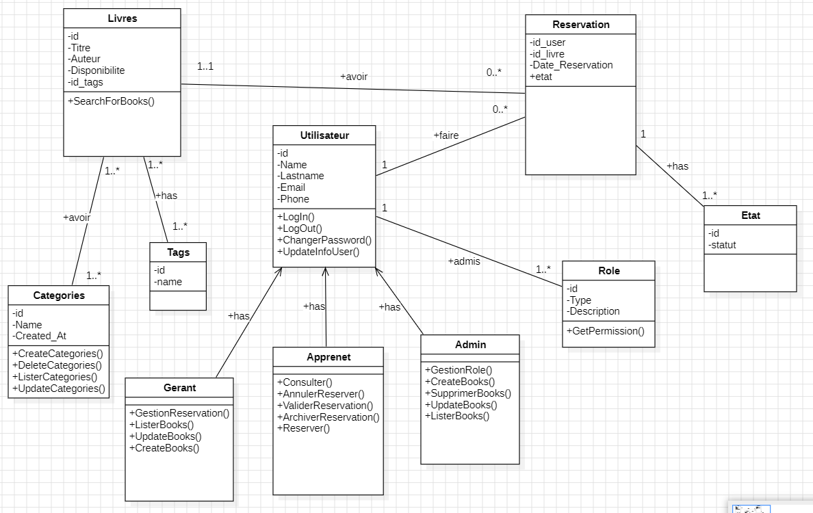

# Backend-Gestionnaire-de-BiblioSchool
  <a href="https://www.linkedin.com/in/aamir-el-amiri-5672ba262/">
    
  </a>
# Application de gestion de bibliothèque scolaire

Ce projet consiste à développer une application web permettant de gérer une bibliothèque scolaire, incluant un système de réservation de livres. L'application est construite en PHP 8 avec la programmation orientée objet (POO) et utilise PDO pour la connexion à une base de données MySQL.

---

## Fonctionnalités principales

### 1. **Système d'authentification sécurisé**
   - Connexion avec sessions et cookies.
   - Déconnexion sécurisée.

### 2. **Gestion multi-rôles**
   - **Administrateur** : Gère les utilisateurs (création, modification des rôles, suppression).
   - **Gérant** : Gère les livres et valide ou rejette les réservations.
   - **Apprenant** : Réserve des livres, consulte et annule ses réservations.

### 3. **Gestion des livres**
   - Ajout, modification, suppression des livres.
   - Association des livres à des tags et catégories pour faciliter la recherche.

### 4. **Réservation des livres**
   - Les apprenants peuvent réserver des livres avec validation du gérant.
   - Statuts des réservations : Pending, Confirmé, Terminé.

### 5. **Archivage des livres réservés**
   - Les livres sont archivés une fois la période de réservation terminée.

---

## Prérequis

- **PHP 8** ou version supérieure.
- **MySQL** (version 5.7 ou supérieure).
- Un serveur web compatible (Apache, Nginx, etc.).

---

## Installation

### Étape 1 : Clonez le repository

```bash
git clone https://github.com/ISTIFANO/Backend-Gestionnaire-de-BiblioSchool.git
cd Backend_Gestionnaire_de_BiblioSchool

##Étape 2 : Installer les dépendances

```bash
composer install

##Étape 3 : Configurer le fichier .env
```bash
DB_HOST=localhost
DB_NAME=biblioschool
DB_USER=root
DB_PASS=

##Étape 4 : Créez la base de données
cd Backend_Gestionnaire_de_BiblioSchool/config/database.sql


##Étape 5 : Lancer le serveur local
```bash
php -S localhost -t public

###Étape 6 : strecture file 

📁 Backend_Gestionnaire_de_BiblioSchool/
│

│   ├── 📁 models/
│   │   ├── Book.php
│   │   ├── User.php
│   │   ├── Reservation.php
│   │   ├── Category.php
│   │   ├── Role.php
│   │   └── Database.php
│   │
│   ├── 📁 views/
│   │   ├── 📁 auth/
│   │   │   ├── login.php
│   │   │   ├── register.php
│   │   │   └── reset-password.php
│   │   │
│   │   ├── 📁 books/
│   │   │   ├── list.php
│   │   │   ├── details.php
│   │   │   ├── create.php
│   │   │   └── edit.php
│   │   │
│   │   ├── 📁 reservations/
│   │   │   ├── create.php
│   │   │   ├── list.php
│   │   │   └── manage.php
│   │   │
│   │   ├── 📁 admin/
│   │   │   ├── dashboard.php
│   │   │   ├── users.php
│   │   │   └── settings.php
│   │   │
│   │   ├── 📁 layouts/
│   │   │   ├── header.php
│   │   │   ├── footer.php
│   │   │   └── sidebar.php
│   │   │
│   │   └── 📁 components/
│   │       ├── search-bar.php
│   │       ├── pagination.php
│   │       └── alerts.php
│   │
│   ├── 📁 controllers/
│   │   ├── AuthController.php
│   │   ├── BookController.php
│   │   ├── ReservationController.php
│   │   ├── CategoryController.php
│   │   ├── UserController.php
│   │   └── AdminController.php
│   │
│   ├── 📁 config/
│   │   ├── database.php
│   │   ├── config.php
│   │   └── routes.php
│   │
│   ├── 📁 services/
│   │   ├── AuthService.php
│   │   ├── EmailService.php
│   │   ├── ValidationService.php
│   │   └── PDFService.php
│   │
│   ├── 📁 middlewares/
│   │   ├── AuthMiddleware.php
│   │   ├── AdminMiddleware.php
│   │   └── RoleMiddleware.php
│   │
│   └── 📁 utils/
│       ├── Helper.php
│       ├── Logger.php
│       └── Security.php
│
├── 📁 public/
│   ├── 📁 css/
│   │   ├── style.css
│   │   └── admin.css
│   │
│   ├── 📁 js/
│   │   ├── main.js
│   │   ├── validation.js
│   │   └── admin.js
│   │
│   ├── 📁 images/
│   │   └── logos/
│   │
│   └── index.php
│
│
├── vendor/
├── composer.json
├── .env
└── README.md
